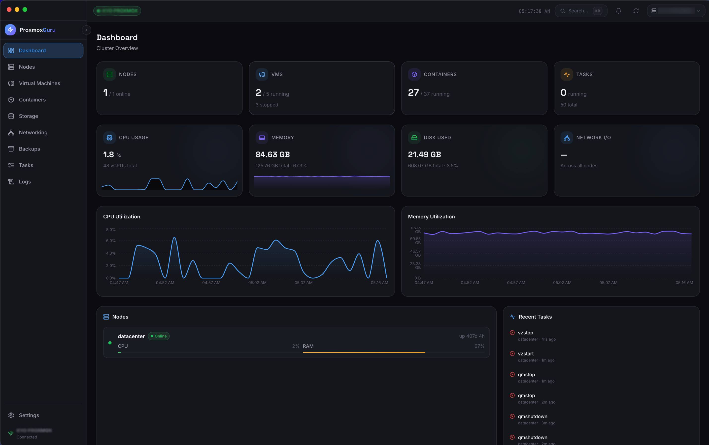
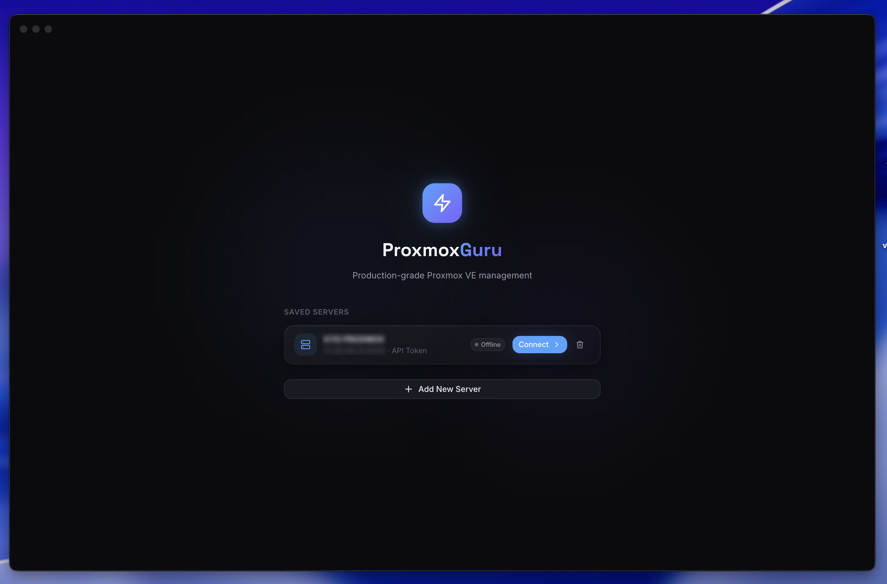

```
██████╗ ██████╗  ██████╗ ██╗  ██╗███╗   ███╗ ██████╗ ██╗  ██╗     ██████╗ ██╗   ██╗██████╗ ██╗   ██╗
██╔══██╗██╔══██╗██╔═══██╗╚██╗██╔╝████╗ ████║██╔═══██╗╚██╗██╔╝    ██╔════╝ ██║   ██║██╔══██╗██║   ██║
██████╔╝██████╔╝██║   ██║ ╚███╔╝ ██╔████╔██║██║   ██║ ╚███╔╝     ██║  ███╗██║   ██║██████╔╝██║   ██║
██╔═══╝ ██╔══██╗██║   ██║ ██╔██╗ ██║╚██╔╝██║██║   ██║ ██╔██╗     ██║   ██║██║   ██║██╔══██╗██║   ██║
██║     ██║  ██║╚██████╔╝██╔╝ ██╗██║ ╚═╝ ██║╚██████╔╝██╔╝ ██╗    ╚██████╔╝╚██████╔╝██║  ██║╚██████╔╝
╚═╝     ╚═╝  ╚═╝ ╚═════╝ ╚═╝  ╚═╝╚═╝     ╚═╝ ╚═════╝ ╚═╝  ╚═╝     ╚═════╝  ╚═════╝ ╚═╝  ╚═╝ ╚═════╝
```

<h3 align="center">The desktop Proxmox manager you always wanted.</h3>

<p align="center">
  <a href="LICENSE"></a>
  <a href="https://github.com/proxmoxguru/proxmoxguru/releases"></a>
  
  <a href="https://github.com/proxmoxguru/proxmoxguru/pulls"></a>
  <a href="https://github.com/proxmoxguru/proxmoxguru/releases"></a>
</p>

---

ProxmoxGuru is a **production-grade cross-platform desktop application** for managing Proxmox VE infrastructure. Built with Electron, React 18, and TypeScript, it brings the full power of the Proxmox API to a polished, keyboard-driven native experience with a futuristic dark UI.

If you've ever wanted a desktop Proxmox client that feels as good as the tools you use every day — this is it.

---

## Screenshots



> **Dashboard** — Real-time cluster overview with animated CPU and memory utilization charts, node health grid, metric cards (nodes, VMs, containers, tasks), and a live recent tasks feed. Data refreshes automatically every few seconds.

<br>



> **Connect Screen** — Add and manage multiple Proxmox servers. Supports API token and username/password authentication. Credentials are encrypted at rest and never leave your machine.

---

## Features

### Core Management
- **Multi-server support** — Connect to multiple Proxmox clusters simultaneously; switch between them from the sidebar
- **Node management** — Full cluster node overview with hardware metrics, health status, and task visibility
- **VM management** — List, filter, search, and control QEMU VMs with full lifecycle actions (start, stop, reboot, suspend, resume, shutdown)
- **Container management** — LXC container management with the same controls as VMs
- **Storage management** — Storage pool overview with usage metrics, content types, and datastore browsing
- **Networking** — Network interface overview per node
- **Backup management** — View scheduled and completed backups across the cluster
- **Tasks monitor** — Live cluster task log with status, duration, and description
- **Logs viewer** — Node syslog and cluster log viewer with filtering

### Interface
- **Futuristic dark UI** — Deep black (#0B0B0F) base with neon blue (#4DA3FF) and electric purple (#7B61FF) accents
- **Animated charts** — Real-time CPU, memory, and network charts powered by Recharts with smooth Framer Motion transitions
- **Raycast-style command palette** — Press ⌘K (or Ctrl+K) to instantly navigate anywhere or execute actions
- **Full keyboard navigation** — ⌘1–9 for direct page jumps, standard arrow key navigation throughout
- **macOS native title bar** — Traffic light button support with custom drag region
- **Responsive sidebar** — Collapsible navigation with status indicators and notification badges
- **Toast notifications** — Non-intrusive status feedback for all async operations

### Security & Storage
- **Encrypted credential storage** — All server credentials are stored using electron-store with OS-level encryption; they never touch the renderer process
- **API token authentication** — Recommended auth method; tokens can be scoped to read-only or specific permissions
- **Username/password support** — Standard Proxmox ticket-based auth for setups without API tokens
- **Self-signed TLS support** — Toggle SSL verification per server for lab/homelab setups
- **Context isolation** — Electron renderer runs with `contextIsolation: true` and `nodeIntegration: false`

### Cross-Platform
- **macOS** — Universal binary (.dmg) supporting Intel (x64) and Apple Silicon (arm64)
- **Windows** — NSIS installer (.exe) for x64
- **Linux** — AppImage and .deb packages

---

## Installation

### Download a Release (Recommended)

Download the latest build for your platform from the [Releases page](https://github.com/proxmoxguru/proxmoxguru/releases):

| Platform | File |
|----------|------|
| macOS (Apple Silicon) | `ProxmoxGuru-x.x.x-arm64.dmg` |
| macOS (Intel) | `ProxmoxGuru-x.x.x-x64.dmg` |
| Windows | `ProxmoxGuru-Setup-x.x.x.exe` |
| Linux (AppImage) | `ProxmoxGuru-x.x.x.AppImage` |
| Linux (Debian/Ubuntu) | `proxmox-guru_x.x.x_amd64.deb` |

**macOS:** Open the `.dmg`, drag `ProxmoxGuru.app` to Applications. On first launch, right-click → Open if Gatekeeper blocks it (the app is not yet notarized).

**Windows:** Run the installer. Windows SmartScreen may warn on first run — click "More info" → "Run anyway".

**Linux (AppImage):** `chmod +x ProxmoxGuru-x.x.x.AppImage && ./ProxmoxGuru-x.x.x.AppImage`

**Linux (.deb):** `sudo dpkg -i proxmox-guru_x.x.x_amd64.deb`

---

### Build From Source

**Prerequisites:**
- Node.js 18 or later
- npm 9 or later
- Git

```bash
# Clone the repository
git clone https://github.com/proxmoxguru/proxmoxguru.git
cd proxmoxguru

# Install dependencies
npm install

# Start in development mode (hot-reload)
npm run dev

# Type-check
npm run typecheck

# Build for your current platform
npm run build

# Build for a specific platform
npm run build:mac
npm run build:win
npm run build:linux
```

Build output is placed in `dist-electron/`.

---

## Getting Started

### Connecting to a Proxmox Server

Launch ProxmoxGuru. You'll land on the Connect page.

1. Click **"Add Server"**
2. Enter a **display name** (e.g., "Home Lab") and your Proxmox host URL (e.g., `https://192.168.1.100:8006`)
3. Choose an authentication method:

#### API Token (Recommended)

API tokens are scoped, revocable, and do not require your full Proxmox password.

1. In the Proxmox web UI, go to **Datacenter → API Tokens → Add**
2. Choose a user (e.g., `root@pam`) and set a token ID (e.g., `proxmoxguru`)
3. Uncheck "Privilege Separation" if you want full access, or assign specific roles
4. Copy the token secret (shown once)
5. In ProxmoxGuru, select **"API Token"** and enter:
   - **Token ID:** `root@pam!proxmoxguru`
   - **Token Secret:** the copied secret

#### Username / Password

Select **"Username/Password"** and enter your Proxmox credentials. ProxmoxGuru authenticates against the Proxmox ticket endpoint and refreshes the session automatically.

> See [docs/PROXMOX_SETUP.md](docs/PROXMOX_SETUP.md) for a detailed guide on Proxmox API token permissions and SSL configuration.

---

## Keyboard Shortcuts

| Shortcut | Action |
|----------|--------|
| `⌘K` / `Ctrl+K` | Open command palette |
| `Escape` | Close command palette / modal |
| `⌘1` / `Ctrl+1` | Navigate to Dashboard |
| `⌘2` / `Ctrl+2` | Navigate to Nodes |
| `⌘3` / `Ctrl+3` | Navigate to VMs |
| `⌘4` / `Ctrl+4` | Navigate to Containers |
| `⌘5` / `Ctrl+5` | Navigate to Storage |
| `⌘6` / `Ctrl+6` | Navigate to Networking |
| `⌘7` / `Ctrl+7` | Navigate to Backups |
| `⌘8` / `Ctrl+8` | Navigate to Tasks |
| `⌘9` / `Ctrl+9` | Navigate to Logs |
| `↑` / `↓` | Navigate command palette results |
| `Enter` | Confirm selection in palette / modal |

> See [docs/KEYBOARD_SHORTCUTS.md](docs/KEYBOARD_SHORTCUTS.md) for the complete reference.

---

## Tech Stack

| Layer | Technology |
|-------|------------|
| Desktop shell | [Electron 28](https://www.electronjs.org/) |
| UI framework | [React 18](https://react.dev/) |
| Language | [TypeScript 5](https://www.typescriptlang.org/) (strict mode) |
| Build tool | [Vite 5](https://vitejs.dev/) |
| Styling | [Tailwind CSS 3](https://tailwindcss.com/) |
| Animation | [Framer Motion](https://www.framer.com/motion/) |
| State management | [Zustand](https://zustand-demo.pmnd.rs/) |
| Data fetching | [TanStack React Query v5](https://tanstack.com/query) |
| Charts | [Recharts](https://recharts.org/) |
| Icons | [Lucide React](https://lucide.dev/) |
| HTTP client | [Axios](https://axios-http.com/) |
| Credential storage | [electron-store](https://github.com/sindresorhus/electron-store) |
| Packaging | [electron-builder](https://www.electron.build/) |
| Routing | [React Router v6](https://reactrouter.com/) |

---

## Architecture Overview

ProxmoxGuru follows a strict Electron security model with a hard boundary between the main process and the renderer.

```
┌─────────────────────────────────────────────────────┐
│                  Renderer Process                    │
│   React 18 + React Router + Zustand + React Query   │
│   (contextIsolation: true, nodeIntegration: false)  │
└────────────────────┬────────────────────────────────┘
                     │  IPC (contextBridge)
┌────────────────────▼────────────────────────────────┐
│                  Main Process                        │
│   Electron + Node.js + electron-store + Axios        │
│   (HTTPS requests to Proxmox, credential storage)   │
└─────────────────────────────────────────────────────┘
```

- The **renderer** never touches the Proxmox API directly and never has access to raw credentials.
- All Proxmox API calls are made by the **main process** over HTTPS, proxied through `ipcMain`/`ipcRenderer`.
- Credentials are encrypted at rest using electron-store and exposed to the renderer only as opaque server IDs.

See [docs/ARCHITECTURE.md](docs/ARCHITECTURE.md) for the full architecture document.

---

## Contributing

Contributions are welcome! Whether you're fixing a bug, adding a feature, improving documentation, or helping with translations — all contributions are valued.

Please read [CONTRIBUTING.md](CONTRIBUTING.md) before opening a pull request.

Key points:
- Use [Conventional Commits](https://www.conventionalcommits.org/) (`feat:`, `fix:`, `docs:`, etc.)
- All code must pass TypeScript strict-mode type checking (`npm run typecheck`)
- Match the existing UI design system (colors, spacing, component patterns)
- Open an issue first for significant changes

---

## License

MIT — see [LICENSE](LICENSE) for full text.

---

## Acknowledgments

- The [Proxmox VE](https://www.proxmox.com/en/proxmox-ve) team for building an outstanding open-source hypervisor platform and a well-documented REST API
- [sindresorhus](https://github.com/sindresorhus) for electron-store and countless other foundational Node packages
- The Electron, React, Vite, Tailwind, Zustand, and TanStack Query teams for the excellent open-source tooling that makes this project possible
- The homelabber and self-hoster community — this project exists because of your enthusiasm for owning your infrastructure
